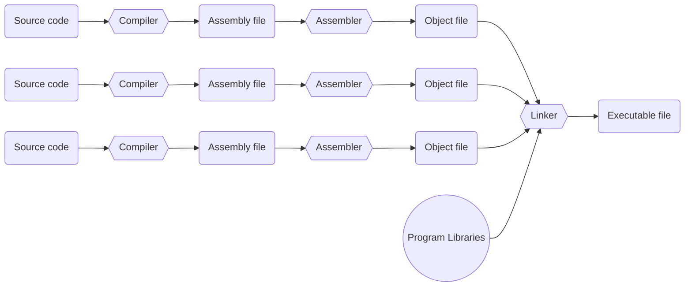

# Overview of Compiler, Assembler, and Linker

This is the high-level overview of how we convert high level language source code such as C into executable.

:::info
For example of gcc, we can use these commands to generate those files.

- `g++ something.c` (compiles, assembles, and links to produce an executable a.out)
- `g++ -S something.c` (produces an assembly file something.s)
- `g++ -c something.c` (produces an object file something.o)
- `g++ something.s` (assembles and links to produce executable a.out)
- `g++ something.o` (links to produce executable a.out)
:::

## References

- <https://courses.engr.illinois.edu/cs232/sp2009/lectures/Examples/lecture6/lecture6.html>
- <https://cs3157.github.io/www/2022-9/lecture-notes/03-compile.pdf>
