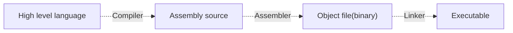
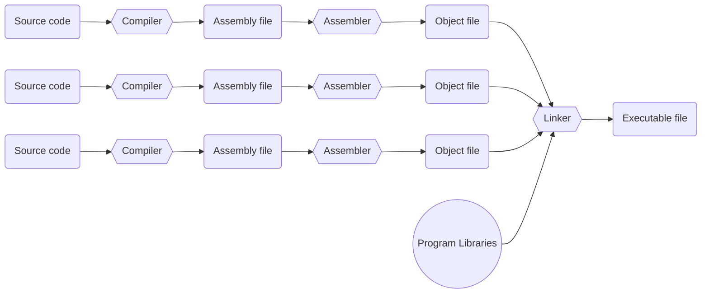
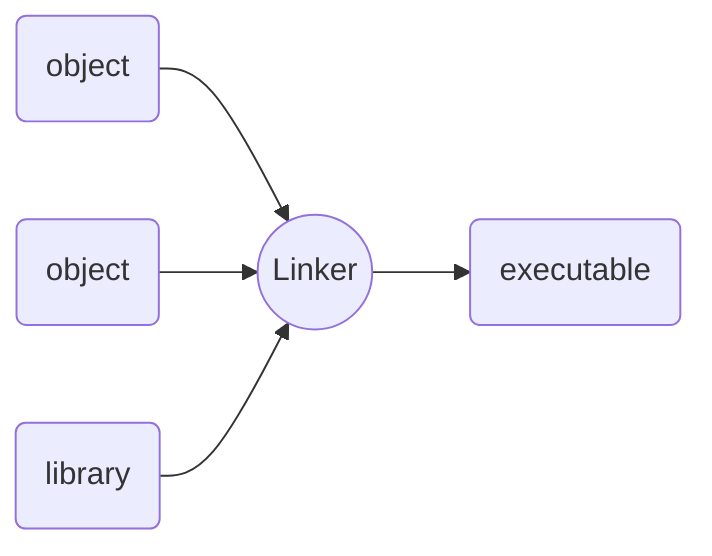
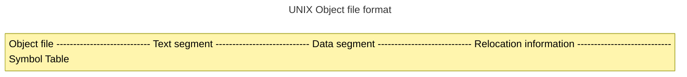

# Overview of Compiler, Assembler, and Linker

This is the high-level overview of how we convert high level language source code such as C into executable.



:::info
For example of gcc, we can use these commands to generate those files.

- `gcc something.c` (compiles, assembles, and links to produce an executable `a.out`)
- `gcc -S something.c` (produces an assembly file `something.s`)
- `gcc -c something.c` (produces an object file `something.o`)
- `gcc something.s` (assembles and links to produce executable `a.out`)
- `gcc something.o` (links to produce executable `a.out`)
:::

:::info

This is an example of C code. Let's assume the file is `tmp.c`.

```c
int main() {
  return 0;
}
```

After executing `gcc -S tmp.c`, you get the following assembly, `tmp.s`. This assembly is written in 64-bit RISC-V(RV64).

```asm
	.file	"tmp.c"
	.option pic
	.text
	.align	1
	.globl	main
	.type	main, @function
main:
	addi	sp,sp,-16
	sd	s0,8(sp)
	addi	s0,sp,16
	li	a5,0
	mv	a0,a5
	ld	s0,8(sp)
	addi	sp,sp,16
	jr	ra
	.size	main, .-main
	.ident	"GCC: (Ubuntu 11.3.0-1ubuntu1~22.04) 11.3.0"
	.section	.note.GNU-stack,"",@progbits
```

When hexing the assembly, we get the following.

```hex
ff010113
00113423
00813023
01010413
00000517
00050513
00000097
000080e7
00000793
00078513
00813083
00013403
01010113
00008067
```

:::

> As we are somewhat familiar with the compiler and the assembler at this point, we'll focus on the linker. The linker enables separate compilation. As is seen in the next figure, an executable can be made up of a number of source files which can be compiled and assembled independently. The linker is responsible for putting those versions together. This has a number of advantages, including: 1) it enables distributing libraries in binary form (i.e., no source), including dynamically linked libraries (DLLs) and when you change your program you only have to recompile the file that was changed.



> Because the various object files will include references to each others code and/or data, these will need to be stitched up during link time. For example in the figure below, the object file that has main includes calls to functions "sub" and "printf". After concatenating all of the object files together, the linker uses the "relocation records" to find all of the addresses that need two be filled in.



>Since assembling to machine code removes all traces of labels from the code, the object file format has to keep these around in a different place; the symbol table is a list of names and their corresponding offsets in the text and data segments. An abstract UNIX object file format is shown below.



## References

- <https://courses.engr.illinois.edu/cs232/sp2009/lectures/Examples/lecture6/lecture6.html>
- <https://cs3157.github.io/www/2022-9/lecture-notes/03-compile.pdf>
- <https://mermaid.js.org/intro/n00b-syntaxReference.html>
